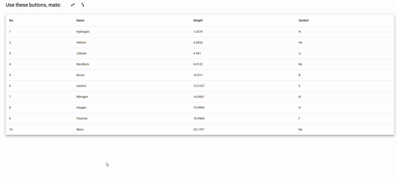

# ngx-sorter

An Angular CDK overlay to sort anything.



## Compatibility

| ngx-sorter | Angular                     |
|:-----------|:----------------------------|
| 3          | 17+ (uses new flow control) |
| 2          | 16+ (uses signals)          |
| 1          | 14+ (Ivy)                   |

## Documentation

+ [V3 docs](https://www.npmjs.com/package/ngx-sorter/v/v3-lts)
+ [V2 docs](https://www.npmjs.com/package/ngx-sorter/v/v2-lts)
+ [V1 docs](https://www.npmjs.com/package/ngx-sorter/v/v1-lts)

## Version 1

Make sure to install Angular Material before installing `ngx-sorter`.

**In the TypeScript**, declare a list of `Sortable`.

```typescript
import {Sortable} from "ngx-sorter";

@Component({/*...*/})
export class MyComponent {
  sortables: Sortable[] = [
    //...
  ];
}
```

**In the template**, declare the overlay and define its trigger:

```html
<button [ngxSorterTriggerFor]="sorter">Sort</button>
<ngx-sorter #sorter [sortables]="sortables"/>
```
